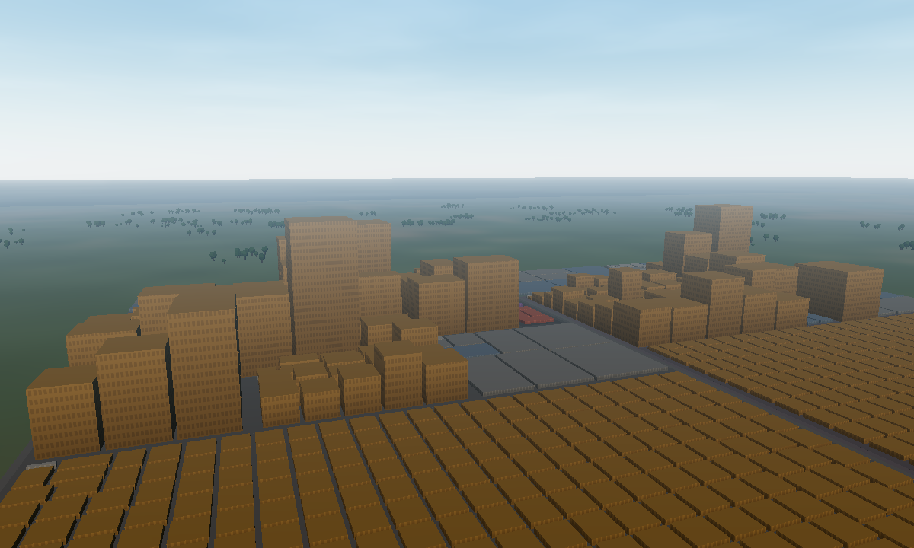
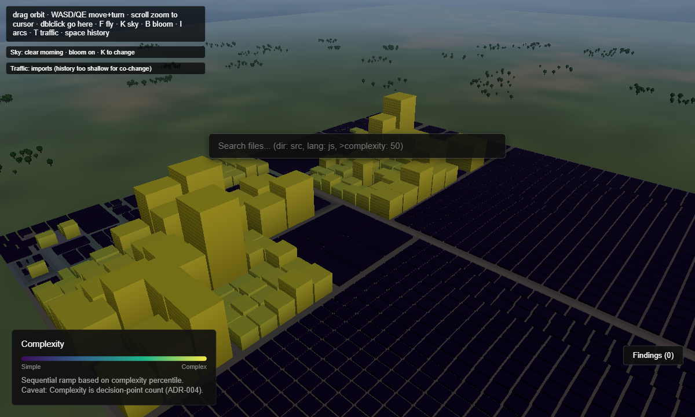
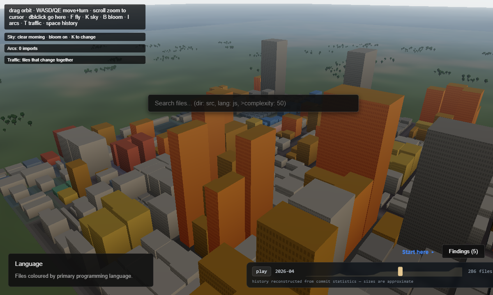

# Chronopolis

See your codebase as a living city, where architecture reflects reality, complexity is visible, and the true cost of changes becomes clear.



## Why Chronopolis?
Traditional static analysis tools output lists and graphs. Chronopolis uses a spatial metaphor to expose the structural health of your repository at a glance. 

- **Scale & Density:** The footprint of a building maps to its lines of code, and its height maps to its function count. You can literally *see* monolithic god classes looming over everything else.
- **Connections:** Inter-file imports manifest as soaring arcs across the skyline. Files that frequently change together pulse with traffic flow on the streets between them.
- **History & Churn:** Time is a first-class citizen. Code that hasn't been touched in years turns grey and cold, while hotspots in active development glow with heat.
- **Narrative:** Chronopolis doesn't just draw blocks; it automatically extracts narrative insights—like the fastest growing file, the biggest flight-risk (bus factor of 1), and hidden coupling.

## 60-Second Quickstart

```bash
# Clone the repository
git clone https://github.com/harshvardhan60792/chronopolis.git
cd chronopolis

# Analyze your own repository (requires Python 3.11+)
python -m citygen build /path/to/your/repo -o my-city.json

# Serve the visualizer and explore your city
python -m citygen serve my-city.json
```

## CLI Reference

`python -m citygen build <repo>` - Analyzes the given directory.
- `--include-vendor`: Do not skip node_modules/.venv/dist/...
- `--python-only`: Only analyze Python files.
- `--max-commits <N>`: Limit git history parsing to N commits.
- `--snapshots <N>`: Set the number of time-machine snapshots to capture (default 24).
- `--gzip`: Output a `.json.gz` file instead of uncompressed JSON.

`python -m citygen export <json> -o <out.html>`
Generates a zero-dependency, self-contained HTML file from your `city.json` that you can email to your team or host on GitHub Pages.

`python -m citygen serve <json>`
Serves the viewer locally and automatically copies your city into it.

`python -m citygen impact <file>`
Reports the blast radius of a file: what other files in the repository depend on it, directly and transitively. Use `--tree` to see the full dependency chain, or `--json` for CI integration.

`python -m citygen risk`
Evaluates which files are most dangerous to change based on a composite of blast radius, ownership risk (bus factor), staleness, complexity, and churn.
- `[paths...]`: Specific files to score.
- `--staged`: Score only the files currently staged in git.
- `--top <N>`: List the top N riskiest files (default 10).
- `--fail-over <SCORE>`: Exit with an error if any scored file exceeds the given risk threshold (e.g. 0.70 for high risk).
- `--json`: Machine-readable output.

`python -m citygen hook`
Manage a pre-commit hook that warns you when staging high-risk files.
- `install`: Install the hook to `.git/hooks/pre-commit`.
  - `--block`: Prevent the commit if high-risk files are staged instead of just warning.
  - `--threshold <SCORE>`: Override the default risk threshold (0.70).
  - `--force`: Overwrite an existing pre-commit hook that isn't ours, backing it up first.
- `uninstall`: Remove the hook if it is ours.
- `run`: Run the hook logic directly.

## How to Read the City



- **Height:** The number of functions/methods in the file.
- **Footprint:** The total Lines of Code (LOC).
- **Colour (Modes 1-6):** Use the number keys to switch the overlay. You can view by Primary Language, Health (hotspots rendered with a warm rim), Recency (cold to warm), Ownership, Bus Factor, and Complexity.
- **Arcs (Press `I`):** Direct import dependencies. The arc goes from the importer to the imported file.
- **Traffic (Press `T`):** Files that frequently change together in git history are connected by glowing traffic paths.

## Getting Around

Navigation is built to feel like a game camera, not a CAD viewport:

- **Drag** to orbit, **scroll** to zoom toward whatever's under the cursor (not the screen center).
- **WASD** pans the camera, **Q/E** rotates it — works in orbit mode, no mode switch needed.
- **Double-click** open ground to fly the camera there.
- Press **F** for a pointer-locked first-person fly mode (WASD + mouse look, Space/Shift for up/down, speed scales with altitude). Buildings are solid — you slide along a wall instead of clipping through it.
- Press **R** to reset the view.
- Leave it alone for 20 seconds and the camera drifts, barely perceptibly, around the skyline — restorative "soft fascination," not a lure. Touch anything and it stops.

Repos with a rougher average health (churn, complexity, single ownership, staleness — the same composite the Health overlay colours by) get a light rain; a calm repo gets a clear sky. No thunder, no flashing — a mood cue, not a storm.

## The Time Machine

Repos with real git history (10+ commits) get a scrubbable timeline at the
bottom of the screen: play through the repo's history, watch it grow, and see
deleted files linger as translucent ruins before they vanish.



## CI Integration

Two ways to add Chronopolis to your own repo — no local install needed for
either, both run entirely in GitHub Actions.

**Risk bot on every PR.** `.github/workflows/pr-preview.yml` builds every
PR's own checkout into a city, computes the risk of the changed files (blast
radius, ownership, complexity, churn, staleness), and posts a comment if it
finds high-risk changes — with a link to a self-contained 3D city HTML
export, so the reviewer gets the finding immediately and the city is an
optional deep dive. Copy that file into any repo's `.github/workflows/` —
it installs `citygen` itself, so it works standalone in a foreign repo.

**A live, always-current city of your repo.** `templates/chronopolis-pages.yml`
deploys your repo as an explorable city to your own GitHub Pages, rebuilt on
every push to main. Copy it in, set Pages source to "GitHub Actions", push —
the file has the exact steps. `citygen` isn't on PyPI yet, so both templates
install straight from source; replace the placeholder repo URL in each with
the real one.

## Performance

Full performance benchmarks, extreme-scale limits, and reproduction steps are documented in `docs/05-PERFORMANCE.md`.

## How it works (Engineering Write-up)
We documented the hardest technical challenge in this project—building an incremental engine that stays strictly byte-identical without dependencies—in our engineering write-up: [The Incremental Engine: Staying Byte-Identical](docs/11-WRITEUP-incremental.md).

## Limitations

- **Deep Parsing:** Python uses the `ast` module by default, but we now support tree-sitter for robust parsing of Java, C#, C/C++, and Python (via `[parsers]` extra). Without tree-sitter, we fallback to regex heuristics for non-Python languages:
  - **JavaScript/TypeScript**, **Ruby**, **Go** — functions and complexity. JS/Ruby support basic import arcs.
  - **Java, C#, C/C++, PHP, Kotlin, Swift, Rust** (without tree-sitter) — complexity only, from reserved keywords. No function counts or import arcs.
  - Every other language gets LOC/SLOC/TODO counts only: complexity stays flat at 1.
- **History Approximation:** We capture git snapshots, not every single commit line-by-line, to keep the analysis under 10 seconds.
- **Ownership:** "Bus factor" and "Ownership" are calculated based on commit counts to a file, not precise blame-based line ownership.

## License

MIT License. See [LICENSE](LICENSE) for details.

*Powered by [three.js](https://threejs.org/) (MIT).*
