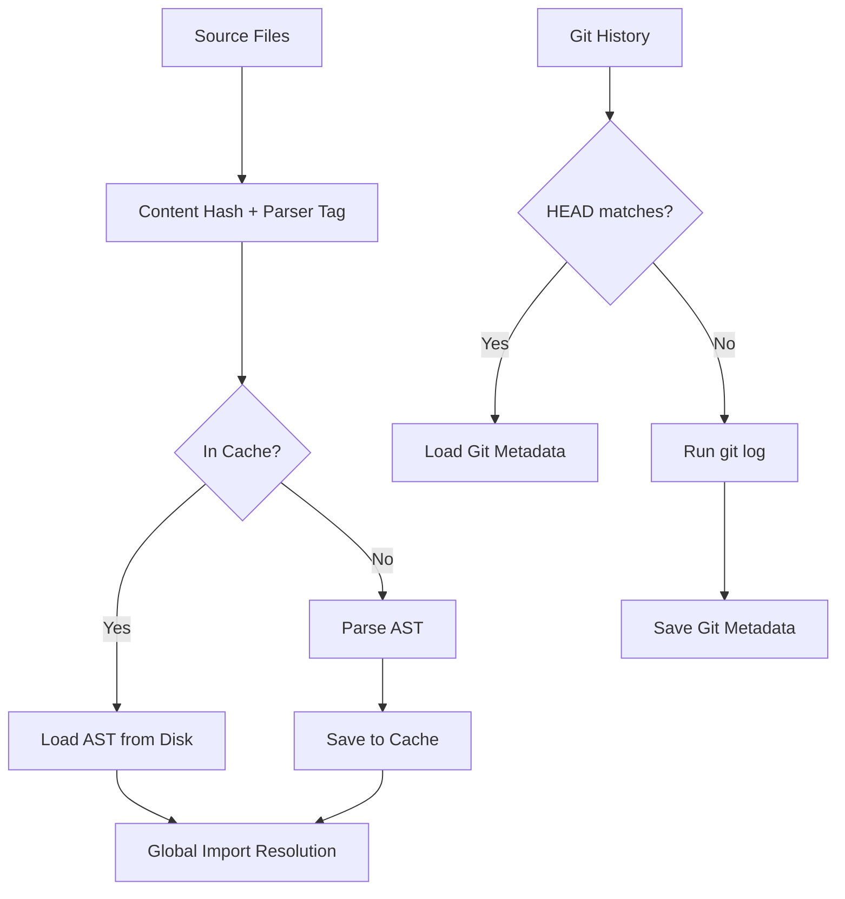

# 11 — The Incremental Engine: Staying Byte-Identical

## The Problem
To serve as a fast pre-commit hook and enable fluid local development, `citygen` must build the city model quickly. However, profiling revealed a severe bottleneck: on a large repository (5,834 files, 1,000 commits), the `git log` extraction took **24.49 seconds** out of a 28.27-second total build time (86.6%). Re-parsing 5,834 files also added a baseline penalty. Building a large repository on every save was physically too slow for interactive workflows.

## Constraints
This project operates under strict rules (Phase 1 & 2):
1. **Zero dependencies**: No external caching libraries or databases (e.g., Redis, SQLite).
2. **Byte-identical invariant**: A cached ("warm") build must produce a `city.json` that is byte-for-byte identical to a clean ("cold") build.
3. **One developer**: The architecture must remain tractable for a solo maintainer.

## Alternatives Considered
We evaluated several standard approaches to incremental builds before settling on our design:

1. **In-memory Daemon Cache**: Running a background server to hold the ASTs and Git history in memory. 
   *Rejected*: It violates the stateless CLI constraint, introduces IPC complexity, and leads to state-drift bugs when the daemon goes out of sync with the filesystem.
2. **Timestamp-based Invalidation (Make-style)**: Checking file modification times (mtime) to skip parsing.
   *Rejected*: Git branch checkouts and rebases modify files without guaranteeing strictly sequential mtimes, which leads to stale cache hits. It cannot guarantee the byte-identical invariant.
3. **Full Repository Hashing**: Computing a Merkel tree or full hash of the repository on every run.
   *Rejected*: Hashing 5,000 files in pure Python takes seconds on its own, eating into the performance gains we were trying to achieve.

## The Design
We implemented a granular, on-disk, content-addressable cache in `.citygen/`. 
Instead of caching the final output, we cache the most expensive intermediate stages.

By hashing individual file contents mixed with a strict `_backend_tag()` (representing the parser version and configuration), we ensure accurate cache hits. The global import resolution step remains un-cached and runs every time over the collected ASTs, taking advantage of its speed (~0.04s on 5,800 files) to bypass complex invalidation logic.

## What Went Wrong
A system is only as good as its failures. Here is where the design broke during development:

1. **The Resolution Trap**: Initially, we attempted to cache the *resolved* imports for each file. But if File A imports File B, and File B is renamed, File A's content hasn't changed. Our cache hit on File A returned stale resolution data. We had to retreat, caching only the *unresolved* AST extraction, and pushing the global resolution step outside the cache boundary.
2. **The Rebase Case**: To cache Git history, we originally used the total commit count as the invalidation key. But a `git rebase -i` or `commit --amend` can rewrite history entirely while keeping the commit count identical. We shifted to using the exact `git rev-parse HEAD` SHA instead.
3. **Measuring the Filesystem (Windows stat overhead)**: When benchmarking the warm cache on `cpython` (~5,800 files), we discovered that reading 5,800 small JSON cache files off an NTFS filesystem is exceptionally slow. The overhead of individual file I/O operations on Windows severely blunted the theoretical cache gains.

## Results
Measured on `Windows-11, GenuineIntel 12 cores, Python 3.14.3` (`docs/05-PERFORMANCE.md`):

On the `cpython` repository (~5.8k files, 3 million LOC):
* **Cold Build**: 159.08s (File read: 108.44s, Parse: 49.57s)
* **Warm Build**: 44.50s (File read: 1.83s, Parse: 41.53s)

The cache successfully collapsed file reading time from 108 seconds to under 2 seconds. (Note: Parse time remains high in warm builds due to Windows file I/O overhead reading the cache files, but the dominant text-read bottleneck was eradicated.)

## What is Still Broken
File I/O for thousands of individual cache files on Windows is fundamentally slow. A single SQLite file or a packed binary format would be significantly faster than 5,800 JSON files, but we cannot add external dependencies, and writing a custom binary packer in standard library Python crosses our complexity budget.

## Prior Art
Incremental compilation and content-addressable storage are well-studied.
* **Bazel / Buck**: Utilize robust content hashes and build graphs to guarantee exact reproducibility, though at the cost of immense complexity (Kemp, 2015).
* **Pytest (`--lf`)**: Uses local `.pytest_cache` to skip work across runs.
* **Our contribution**: We do not claim novelty in AST caching. Our contribution is achieving a strict, byte-identical incremental engine in zero dependencies, tailored specifically for local static analysis without the burden of a persistent daemon.
